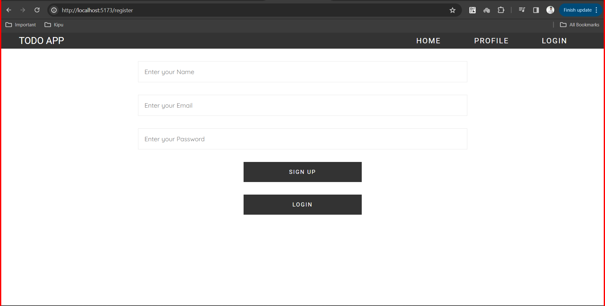
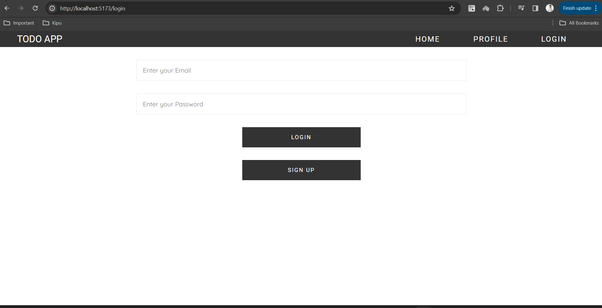
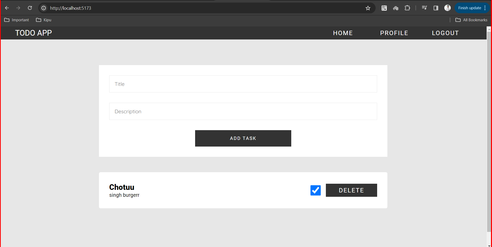
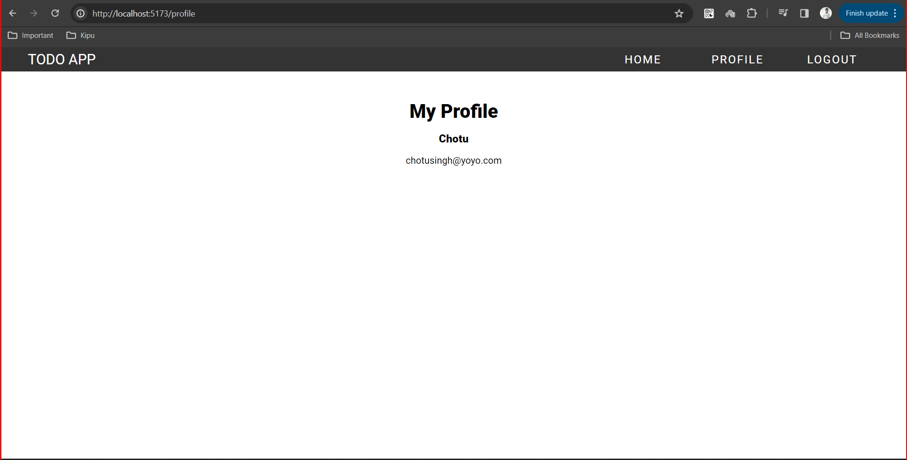

# TODO FRONTEND

It consist of various CRUD operaions.

1. Users

- Access all the usr API by prefixing this **/api/v1/users**

| API TYPE | ENDPOINT  | DESCRIPTION                        |
| -------- | --------- | ---------------------------------- |
| GET      | /all      | Retrieve all users                 |
| POST     | /register | Create a new user and setCookies   |
| POST     | /login    | Login specific user and setCookies |
| GET      | /me       | Get user profile details           |
| GET      | /logout   | Logout user and delete cookie      |

2. Tasks

- Access all the usr API by prefixing this **/api/v1/task**

| API TYPE | ENDPOINT | DESCRIPTION                 |
| -------- | -------- | --------------------------- |
| POST     | /new     | Create a new task           |
| GET      | /my-task | Get users all tasks         |
| PUT      | /:taskid | Edit paricular task         |
| DELETE   | /:taskid | Delete user particular task |

API is hosted on [link](https://todo-app-rpcb.onrender.com/)
For more details checkout [Notes](https://1drv.ms/o/s!AmoVfaIN_qP9i5FfUZIgCIrfVdZM2w?e=bLN7ec)

### Deploying it live on [my-todo-tasks.vercel.app](https://my-todo-tasks.vercel.app/)

### Final look

1. Register Page
   
2. Login Page
   
3. Home Page
   
4. Profile Page
   
